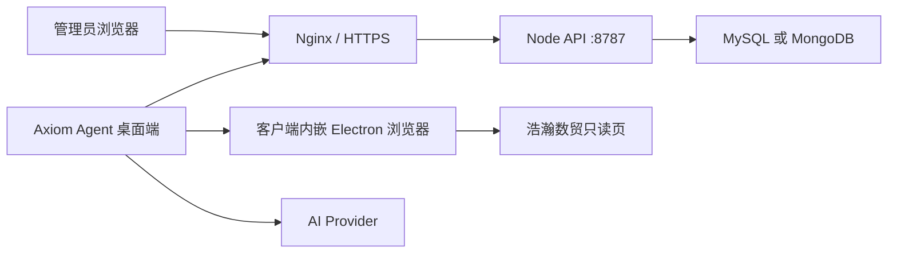

# Axiom Agent 部署手册

你要部署的只有两块：**API 服务**和**后台管理页**（账号、分配、审计）。**桌面客户端不装在服务器上**，用户从 GitHub Releases 自己下载，登录页填写你的服务地址。每个桌面用户在客户端里添加自己的 Provider，后台看不到密钥。

生产用 Docker 部署 API 和后台。桌面客户端不装在服务器上，用户从 GitHub Releases 下载，登录页填写公网服务地址。实盘任务出现买卖建议时会弹窗，确认后才会下单。

本地开发仍看 [install.md](./install.md) 与仓库 [README.md](../README.md)。一键部署脚本见 [scripts](../scripts)。

## 1. 拓扑



规则：

- **一个 API 实例 + 一个数据库**。不要让后台和桌面各自起内存服务。
- 打包桌面端**默认不内嵌 API**。登录页填写生产 API 地址。
- 浏览器、登录、盘口及 K 线采集、指标计算、行情分层和 AI 请求全部运行在客户端。服务端只管理账号、数据、调度与确认状态。
- 生产强制 `AXIOM_REQUIRE_DESKTOP_BROWSER=1` 和 `AXIOM_REQUIRE_DESKTOP_AI=1`；桌面离线或版本过旧会明确报错，不会回退到服务端浏览器。
- 已审核经验全文直接发送给 AI，生产不建 RAG 切片索引。客户端每轮只请求一次模型，超过上下文上限明确报错。
- `AXIOM_EMBEDDED_API=1` 只允许一次性本机演示，不能用于多人生产。

| 角色 | 入口 | 说明 |
|---|---|---|
| 桌面用户 | 安装包 / `npm run dev:desktop` | 任务、连接器、Provider、Skills、观察与建议 |
| 管理员 | `https://<host>/admin.html` | 账号、分配、审计；不能配 Provider / 连接器 |
| API | `https://<host>/api/*` 或内网 `HOST:PORT` | Fastify，默认 `127.0.0.1:8787` |

服务器已有 Docker 时用 Compose（推荐）。MySQL / Mongo 只绑内网 IP，客户端走公网：

```bash
scripts/deploy-docker.sh --host <公网IP> --internal-host <内网IP> --password '<SSH密码>'
```

不要把密码写进仓库。桌面安装包仍由 Release 提供给用户下载。脚本会导出本机 `axiom_agent` 库和 Vault，并沿用原来的 `APP_SECRET`，否则 Provider / 凭据密文解不开。桌面端服务地址填公网 `http://<IP>` 或 `http://<IP>:8787`，不要加 `/api`。

首次用 Docker 装好后，把服务器改成 git 拉取（Deploy key + Actions SSH）：

```bash
scripts/setup-git-deploy.sh
```

日常发布走 GitHub Release，或在 Actions 手动跑 **Deploy API**。Actions 构建镜像并传到服务器；服务器先停止旧 API 释放浏览器进程，再加载镜像并以 `--no-build --no-deps` 更新 API 和后台。数据库容器、卷及 `.env` 不变。不要在生产执行旧版 bootstrap / 本地数据导入脚本。

## 2. 机器要求

| 项目 | 要求 |
|---|---|
| 运行时 | Node.js 20+ |
| 数据库 | MySQL 8（推荐）或 MongoDB 6+ |
| 反向代理 | Nginx 或等价，终止 TLS |
| 浏览器 | 客户端内置 Electron Chromium；API 镜像不安装 Chromium |
| 出网 | 客户端访问目标交易站和 Provider；服务端访问数据库与更新源 |
| 磁盘 | 服务端 `AXIOM_DATA_DIR` 保存 Vault、密钥；浏览器配置只在客户端 |

生产不要用 `DB_MODE=memory`，不要设 `ALLOW_MEMORY_FALLBACK=1`。

## 3. 环境变量

在 API 工作目录放置 `.env`，**不要提交 Git**。从仓库复制：

```bash
cp .env.example .env
```

| 变量 | 生产要求 | 说明 |
|---|---|---|
| `HOST` | `127.0.0.1`（反代后）或 `0.0.0.0` | 监听地址。公网暴露时必须前面加 HTTPS |
| `PORT` | `8787` | API 端口 |
| `APP_SECRET` | **必改**，长随机串 | AES-256-GCM 加密 Provider Key。更换会使已存密钥无法解密 |
| `DB_MODE` | `mysql` 或 `mongo` | 持久化后端 |
| `MYSQL_URL` | MySQL 时必填 | 库名须与 `db/mysql/schema.sql` 一致 |
| `MONGO_URL` / `MONGO_DB` | Mongo 时必填 | 先执行 `db/mongo/indexes.js` |
| `ALLOW_MEMORY_FALLBACK` | `0` | 库连不上应直接失败 |
| `ADMIN_USERNAME` / `ADMIN_PASSWORD` | **必改** | 后台登录 |
| `ADMIN_SESSION_TTL_SEC` | `28800` | 管理会话秒数 |
| `USER_SESSION_TTL_SEC` | `2592000` | 桌面登录会话秒数，默认 30 天 |
| `DESKTOP_USERNAME` / `DESKTOP_PASSWORD` / `DESKTOP_DISPLAY_NAME` | 可选 | 首次启动创建桌面用户并分配已有任务 |
| `CORS_ALLOWED_ORIGINS` | **后台页面源** | 逗号分隔，例如 `https://ops.example.com`。Electron 的 `null` 已内置 |
| `BROWSER_ALLOWED_DOMAINS` | 含目标域名 | 默认需含 `smyw.haohandahan.cn` |
| `AXIOM_DATA_DIR` | 固定数据盘路径 | 服务端 Vault 与密钥 |
| `AXIOM_REQUIRE_DESKTOP_BROWSER` | `1` | 禁止服务端启动浏览器，采集与分析仅由桌面执行 |
| `AXIOM_REQUIRE_DESKTOP_AI` | `1` | 模型 HTTP 请求仅由桌面发出 |
| `AXIOM_SECRET_FILE` / `AXIOM_VAULT_FILE` | 建议放数据盘 | 本地密钥与凭据文件 |
| `HAOHAN_ANALYSIS_TIMEFRAMES` | `1m,1h,1d,1mo` | 只读采集周期 |
| `HAOHAN_KLINE_COUNT` | `2000` | 单周期请求上限 |
| `MONITOR_POLL_INTERVAL_MS` | 可选 `1000–120000` | 覆盖按周期推导的轮询 |
| `BROWSER_CDP_URL` | 可选 | 接到已打开的 Chrome，而不是再起一套配置 |

会话：桌面 `x-user-token`，后台 `x-admin-token`。管理令牌不能访问工作区、任务控制、连接器、凭据、Provider、Skills。

## 4. 数据库

### MySQL

```bash
mysql -h127.0.0.1 -P3306 -uroot -p < db/mysql/schema.sql
```

```dotenv
DB_MODE=mysql
MYSQL_URL=mysql://axiom:<password>@127.0.0.1:3306/axiom_agent
ALLOW_MEMORY_FALLBACK=0
```

启动后 persistence 会补缺列（如 `tasks.runtime_json`、`providers.owner_user_id`），不会覆盖已有表。

Docker 示例：

```bash
docker run -d --name axiom-mysql --restart unless-stopped \
  -e MYSQL_ROOT_PASSWORD='<root-password>' \
  -e MYSQL_DATABASE=axiom_agent \
  -e MYSQL_USER=axiom \
  -e MYSQL_PASSWORD='<password>' \
  -p 127.0.0.1:3306:3306 \
  mysql:8
```

### MongoDB

```dotenv
DB_MODE=mongo
MONGO_URL=mongodb://127.0.0.1:27017
MONGO_DB=axiom_agent
```

在目标库执行 `db/mongo/indexes.js`。

## 5. 部署 API

```bash
git clone <repo> /opt/axiom-agent
cd /opt/axiom-agent
git checkout v0.2.8
npm ci --omit=dev
cp .env.example .env
# 编辑 .env
node server/index.mjs
```

健康检查：

```bash
curl -sS http://127.0.0.1:8787/api/health
```

应返回 `ok: true`，且 `persistence.available` 为 true。

### systemd

`/etc/systemd/system/axiom-api.service`：

```ini
[Unit]
Description=Axiom Agent API
After=network.target mysql.service

[Service]
Type=simple
WorkingDirectory=/opt/axiom-agent
EnvironmentFile=/opt/axiom-agent/.env
ExecStart=/usr/bin/node server/index.mjs
Restart=on-failure
RestartSec=3
User=axiom
Group=axiom

[Install]
WantedBy=multi-user.target
```

```bash
sudo systemctl daemon-reload
sudo systemctl enable --now axiom-api
sudo systemctl status axiom-api
```

进程收到 `SIGTERM` / `SIGINT` 会停监控循环并关闭库连接。

### 后台静态页

```bash
npm ci
npm run build
```

产物：`dist/index.html`（用户页，一般只进 Electron）、`dist/admin.html`（后台）。用 Nginx 只对外提供 `admin.html` 与 `/api` 反代即可。

## 6. Nginx

把后台和 API 放在同一 HTTPS 源，可减少跨域配置。仍须把该源写入 `CORS_ALLOWED_ORIGINS`。

```nginx
server {
  listen 443 ssl;
  server_name ops.example.com;

  ssl_certificate     /etc/ssl/certs/ops.example.com.crt;
  ssl_certificate_key /etc/ssl/private/ops.example.com.key;

  root /opt/axiom-agent/dist;
  index admin.html;

  location /api/ {
    proxy_pass http://127.0.0.1:8787;
    proxy_http_version 1.1;
    proxy_set_header Host $host;
    proxy_set_header X-Forwarded-For $proxy_add_x_forwarded_for;
    proxy_set_header X-Forwarded-Proto $scheme;
    proxy_read_timeout 180s;
  }

  location /api/tasks/ {
    proxy_pass http://127.0.0.1:8787;
    proxy_http_version 1.1;
    proxy_set_header Host $host;
    proxy_set_header Connection "";
    proxy_buffering off;
    proxy_read_timeout 3600s;
  }
}
```

对应 `.env`：

```dotenv
HOST=127.0.0.1
PORT=8787
CORS_ALLOWED_ORIGINS=https://ops.example.com
```

桌面端「服务地址」填 `https://ops.example.com`（不要带 `/api` 路径）。

## 7. 桌面端

1. 从 [GitHub Releases](https://github.com/zhyebe/ai-k-agent/releases) 安装对应版本，或本机 `npm run dist:mac` / `npm run dist:win`。
2. 打开登录页，设置服务地址为生产 API，点「连接测试」。
3. 用后台分配过的桌面账号登录。
4. 在连接器里配置目标 URL、托管登录凭据、选择 Provider（密钥只进服务端加密存储）。
5. 打开目标交易页并保持登录，再「开始观察」或「立即分析」。

地址保存在本机 `connection.json`（Electron `userData`）。也可用环境变量 `AXIOM_API_URL`。

分析认**当前页面品种、报价、资金、盘口**，不会用任务代码去拼另一张看不见的图，也不会把页面上的余额写成 0。

未签名 macOS 包可能被 Gatekeeper 拦截，只适合内测。正式分发需要签名与公证，见 README「Release 与自动更新」。

## 8. 浏览器与目标站

客户端必须能访问浩瀚数贸，内置适配器只允许已支持的目标域名：

```dotenv
BROWSER_ALLOWED_DOMAINS=localhost,127.0.0.1,smyw.haohandahan.cn
```

- 浏览器配置保存在客户端 Electron `userData/browser-profiles`，按服务地址、账号和任务隔离。
- 托管凭据经过服务端账号校验，只在本次桌面登录调用中使用，不写入客户端凭据库。
- 客户端退出时关闭浏览器；断线时中止在途请求，WebSocket 心跳负责检测失效连接。
- 用户点击市场栏浏览器图标可打开交易窗口。实盘买入和卖出仍必须确认后才提交。
- 各盘买卖档位、价差、挂单量与失衡指标和 K 线一起分析；副盘盘口变化也会触发新一轮分析。

公开 K 线接口只有交易所已返回的根数。页面上的分时图是**当天走势**，不是多年日线；没有的周期就如实缺失，不编历史。

## 9. Provider（桌面用户自己加）

后台**不能**创建或查看模型密钥。每个桌面用户在客户端「连接器 → 添加 Provider」写入自己的 Endpoint、模型和 Key：

1. 密钥用 `APP_SECRET` 加密进 MySQL `providers.encrypted_key`，只对当前桌面账号可见。
2. 保存后可点「使用」，作为该任务的分析模型。
3. 根地址（无路径或 `/`）走 Responses；带 `/v1` 的地址走 Chat Completions。也可在桌面里手动指定协议。
4. 默认列表是空的，需要每个桌面账号自己添加 Provider。

没有可用 Provider 时模型阶段保持 HOLD，并带 `PROVIDER_NOT_CONFIGURED`。

## 10. 发布桌面安装包

推送 `v*` 标签后，[`.github/workflows/release.yml`](../.github/workflows/release.yml) 构建 macOS universal 与 Windows x64，并上传 GitHub Release（含 `latest-mac.yml` / `latest.yml`）。

```bash
git tag v0.2.8
git push origin main --tags
```

本地（需 `GH_TOKEN`）：

```bash
npm run release:mac
npm run release:win
```

已安装的生产包向 GitHub Release 检查并下载 dmg / NSIS 安装包；开发模式不会打 GitHub。

## 11. 上线检查

1. `curl https://<host>/api/health` → `ok`，库 `available`。
2. 浏览器打开 `https://<host>/admin.html`，用管理账号登录，创建桌面用户并分配任务。
3. 桌面端改服务地址、登录、把任务切到「实盘（确认后下单）」、保存 Provider、测试连接器。
4. 目标页保持登录后「立即分析」，输出流为 `connect → login → collect → analyze → rules → action`。
5. `BUY` / `SELL` 会弹确认窗；点确认后才会在已登录页面提交订单。观察模式确认后也不会实盘下单。
6. 模型请求必须从桌面本机发出；API 服务器不应出现对模型网关的直连。桌面离线时分析应失败为 `DESKTOP_AI_OFFLINE`。
7. 「开始观察」多轮后，行情不变应跳过模型；「停止观察」后不再开新轮次。

实盘必须弹窗确认。生产 Compose 设置 `AXIOM_REQUIRE_DESKTOP_AI=1`。

## 12. 安全

- 不要把 `.env`、`.axiom-data`、Vault、数据库备份提交到 Git。
- `APP_SECRET`、管理密码、桌面密码、Provider Key、目标站密码分开保管。
- API 容器不直接对公网暴露；Nginx 对外开 80，并可用 8787 作为桌面端默认端口的入口。
- 定期轮转桌面用户密码；停用账号用后台状态，不要共用一个操作员。
- 更换 `APP_SECRET` 前先导出/重录 Provider，否则旧密文无法解密。

## 13. 常见问题

| 现象 | 处理 |
|---|---|
| `MYSQL_CONNECTION_FAILED` | 检查 `MYSQL_URL`、库是否已建、`ALLOW_MEMORY_FALLBACK` 是否为 0 |
| 后台能开、桌面连不上 | 服务地址填公网 `http://IP` 或 `http://IP:8787`，不要带 `/api`；安全组放行 80 和 8787；`CORS_ALLOWED_HOSTS` 含该 IP |
| 健康检查 persistence 不可用 | 进程连的不是你以为的那套库，或权限不足 |
| 分析提示重新登录 | 在桌面连接器确认凭据，或打开客户端交易浏览器完成登录 |
| 账户权益为 `--` / 0 | 页面可见「可用资金」才会同步；确认采集的是当前登录页 |
| 分析的品种和屏幕不一致 | 把目标页切到要看的合约再分析；以页面品种为准 |
| 模型 404 / HTML | 根地址走 Responses；带 `/v1` 的地址走 Chat Completions |
| macOS 打不开安装包 | 未签名包；系统设置里允许，或走已签名 Release |

升级：`git fetch && git checkout <tag> && npm ci --omit=dev && systemctl restart axiom-api`，后台静态页重新 `npm run build` 后覆盖 Nginx `root`。
