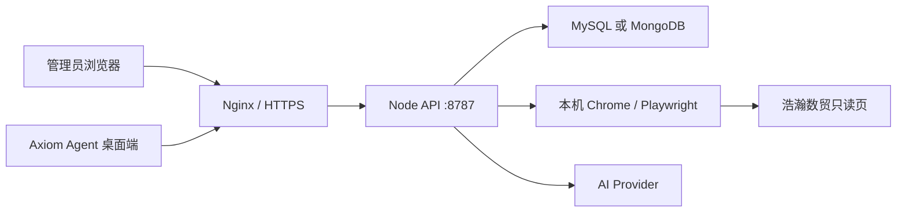

# Axiom Agent 部署手册

你要部署的只有两块：**API 服务**和**后台管理页**（账号、分配、审计）。**桌面客户端不装在服务器上**，用户从 GitHub Releases 自己下载，登录页填写你的服务地址。每个桌面用户在客户端里添加自己的 Provider，后台看不到密钥。

当前版本只做观察与建议，服务端禁止下单、撤单、提现，也不会点击目标站的买入 / 卖出。

本地开发仍看 [install.md](./install.md) 与仓库 [README.md](../README.md)。一键部署脚本见 [scripts](../scripts)。

## 1. 拓扑



规则：

- **一个 API 实例 + 一个数据库**。不要让后台和桌面各自起内存服务。
- 打包桌面端**默认不内嵌 API**。登录页填写生产 API 地址。
- 行情采集、登录填充、Playwright 都跑在 **API 进程所在机器**，不跑在操作员本机浏览器里。
- `AXIOM_EMBEDDED_API=1` 只允许一次性本机演示，不能用于多人生产。

| 角色 | 入口 | 说明 |
|---|---|---|
| 桌面用户 | 安装包 / `npm run dev:desktop` | 任务、连接器、Provider、Skills、观察与建议 |
| 管理员 | `https://<host>/admin.html` | 账号、分配、审计；不能配 Provider / 连接器 |
| API | `https://<host>/api/*` 或内网 `HOST:PORT` | Fastify，默认 `127.0.0.1:8787` |

以后把服务器 IP 和 SSH 密码发过来即可部署，不要把密码写进仓库：

```bash
scripts/bootstrap-server.sh --host <IP> --user root --password '<SSH密码>'
# 以后更新服务端 + 后台：
scripts/deploy.sh --host <IP> --user root --password '<SSH密码>'
```

脚本只装 API、MySQL、Nginx 和 `admin.html`。桌面安装包仍由 Release 提供给用户下载。

## 2. 机器要求

| 项目 | 要求 |
|---|---|
| 运行时 | Node.js 20+ |
| 数据库 | MySQL 8（推荐）或 MongoDB 6+ |
| 反向代理 | Nginx 或等价，终止 TLS |
| 浏览器 | API 主机安装 Google Chrome，或 `npx playwright install chromium` |
| 出网 | `smyw.haohandahan.cn`、`smyt.haohandahan.cn`、已配置的 Provider 地址 |
| 磁盘 | `AXIOM_DATA_DIR` 可写（浏览器配置、Vault、本地密钥文件） |

生产不要用 `DB_MODE=memory`，不要设 `ALLOW_MEMORY_FALLBACK=1`。

## 3. 环境变量

在 API 工作目录放置 `.env`，**不要提交 Git**。从仓库复制：

```bash
cp .env.example .env
```

| 变量 | 生产要求 | 说明 |
|---|---|---|
| `HOST` | `127.0.0.1`（反代后）或 `0.0.0.0` | 监听地址。公网暴露时必须前面加 HTTPS |
| `PORT` | `8787` | API 端口 |
| `APP_SECRET` | **必改**，长随机串 | AES-256-GCM 加密 Provider Key。更换会使已存密钥无法解密 |
| `DB_MODE` | `mysql` 或 `mongo` | 持久化后端 |
| `MYSQL_URL` | MySQL 时必填 | 库名须与 `db/mysql/schema.sql` 一致 |
| `MONGO_URL` / `MONGO_DB` | Mongo 时必填 | 先执行 `db/mongo/indexes.js` |
| `ALLOW_MEMORY_FALLBACK` | `0` | 库连不上应直接失败 |
| `ADMIN_USERNAME` / `ADMIN_PASSWORD` | **必改** | 后台登录 |
| `ADMIN_SESSION_TTL_SEC` | `28800` | 管理会话秒数 |
| `DESKTOP_USERNAME` / `DESKTOP_PASSWORD` / `DESKTOP_DISPLAY_NAME` | 可选 | 首次启动创建桌面用户并分配已有任务 |
| `CORS_ALLOWED_ORIGINS` | **后台页面源** | 逗号分隔，例如 `https://ops.example.com`。Electron 的 `null` 已内置 |
| `BROWSER_ALLOWED_DOMAINS` | 含目标域名 | 默认需含 `smyw.haohandahan.cn` |
| `AXIOM_DATA_DIR` | 固定数据盘路径 | Playwright 配置、Vault |
| `AXIOM_SECRET_FILE` / `AXIOM_VAULT_FILE` | 建议放数据盘 | 本地密钥与凭据文件 |
| `DEEPSEEK_API_KEY` 等 | 可选，仅首次种子 | 日常在桌面「连接器」保存 Provider |
| `HAOHAN_ANALYSIS_TIMEFRAMES` | `1m,1h,1d,1mo` | 只读采集周期 |
| `HAOHAN_KLINE_COUNT` | `2000` | 单周期请求上限 |
| `MONITOR_POLL_INTERVAL_MS` | 可选 `1000–120000` | 覆盖按周期推导的轮询 |
| `BROWSER_CDP_URL` | 可选 | 接到已打开的 Chrome，而不是再起一套配置 |

会话：桌面 `x-user-token`，后台 `x-admin-token`。管理令牌不能访问工作区、任务控制、连接器、凭据、Provider、Skills。

## 4. 数据库

### MySQL

```bash
mysql -h127.0.0.1 -P3306 -uroot -p < db/mysql/schema.sql
```

```dotenv
DB_MODE=mysql
MYSQL_URL=mysql://axiom:<password>@127.0.0.1:3306/axiom_agent
ALLOW_MEMORY_FALLBACK=0
```

启动后 persistence 会补缺列（如 `tasks.runtime_json`、`providers.owner_user_id`），不会覆盖已有表。

Docker 示例：

```bash
docker run -d --name axiom-mysql --restart unless-stopped \
  -e MYSQL_ROOT_PASSWORD='<root-password>' \
  -e MYSQL_DATABASE=axiom_agent \
  -e MYSQL_USER=axiom \
  -e MYSQL_PASSWORD='<password>' \
  -p 127.0.0.1:3306:3306 \
  mysql:8
```

### MongoDB

```dotenv
DB_MODE=mongo
MONGO_URL=mongodb://127.0.0.1:27017
MONGO_DB=axiom_agent
```

在目标库执行 `db/mongo/indexes.js`。

## 5. 部署 API

```bash
git clone <repo> /opt/axiom-agent
cd /opt/axiom-agent
git checkout v0.2.1
npm ci --omit=dev
cp .env.example .env
# 编辑 .env
node server/index.mjs
```

健康检查：

```bash
curl -sS http://127.0.0.1:8787/api/health
```

应返回 `ok: true`，且 `persistence.available` 为 true。

### systemd

`/etc/systemd/system/axiom-api.service`：

```ini
[Unit]
Description=Axiom Agent API
After=network.target mysql.service

[Service]
Type=simple
WorkingDirectory=/opt/axiom-agent
EnvironmentFile=/opt/axiom-agent/.env
ExecStart=/usr/bin/node server/index.mjs
Restart=on-failure
RestartSec=3
User=axiom
Group=axiom

[Install]
WantedBy=multi-user.target
```

```bash
sudo systemctl daemon-reload
sudo systemctl enable --now axiom-api
sudo systemctl status axiom-api
```

进程收到 `SIGTERM` / `SIGINT` 会停监控循环并关闭库连接。

### 后台静态页

```bash
npm ci
npm run build
```

产物：`dist/index.html`（用户页，一般只进 Electron）、`dist/admin.html`（后台）。用 Nginx 只对外提供 `admin.html` 与 `/api` 反代即可。

## 6. Nginx

把后台和 API 放在同一 HTTPS 源，可减少跨域配置。仍须把该源写入 `CORS_ALLOWED_ORIGINS`。

```nginx
server {
  listen 443 ssl;
  server_name ops.example.com;

  ssl_certificate     /etc/ssl/certs/ops.example.com.crt;
  ssl_certificate_key /etc/ssl/private/ops.example.com.key;

  root /opt/axiom-agent/dist;
  index admin.html;

  location /api/ {
    proxy_pass http://127.0.0.1:8787;
    proxy_http_version 1.1;
    proxy_set_header Host $host;
    proxy_set_header X-Forwarded-For $proxy_add_x_forwarded_for;
    proxy_set_header X-Forwarded-Proto $scheme;
    proxy_read_timeout 180s;
  }

  location /api/tasks/ {
    proxy_pass http://127.0.0.1:8787;
    proxy_http_version 1.1;
    proxy_set_header Host $host;
    proxy_set_header Connection "";
    proxy_buffering off;
    proxy_read_timeout 3600s;
  }
}
```

对应 `.env`：

```dotenv
HOST=127.0.0.1
PORT=8787
CORS_ALLOWED_ORIGINS=https://ops.example.com
```

桌面端「服务地址」填 `https://ops.example.com`（不要带 `/api` 路径）。

## 7. 桌面端

1. 从 [GitHub Releases](https://github.com/zhyebe/ai-k-agent/releases) 安装对应版本，或本机 `npm run dist:mac` / `npm run dist:win`。
2. 打开登录页，设置服务地址为生产 API，点「连接测试」。
3. 用后台分配过的桌面账号登录。
4. 在连接器里配置目标 URL、托管登录凭据、选择 Provider（密钥只进服务端加密存储）。
5. 打开目标交易页并保持登录，再「开始观察」或「立即分析」。

地址保存在本机 `connection.json`（Electron `userData`）。也可用环境变量 `AXIOM_API_URL`。

分析认**当前页面品种、报价、资金、盘口**，不会用任务代码去拼另一张看不见的图，也不会把页面上的余额写成 0。

未签名 macOS 包可能被 Gatekeeper 拦截，只适合内测。正式分发需要签名与公证，见 README「Release 与自动更新」。

## 8. 浏览器与目标站

API 主机必须能打开浩瀚数贸：

```dotenv
BROWSER_ALLOWED_DOMAINS=localhost,127.0.0.1,smyw.haohandahan.cn
```

- 默认用持久化 Chrome / Playwright 配置，目录在 `AXIOM_DATA_DIR/browser-profiles`。
- 重启 API 后登录态可能失效；分析若回到 `#/login` 会用托管凭据自动填登录，**不会提交买卖表单**。
- 需要跟已打开的 Chrome 共用会话时，设 `BROWSER_CDP_URL`。
- 无头环境建议安装系统 Chrome，并保证沙箱权限足够。

公开 K 线接口只有交易所已返回的根数。页面上的分时图是**当天走势**，不是多年日线；没有的周期就如实缺失，不编历史。

## 9. Provider（桌面用户自己加）

后台**不能**创建或查看模型密钥。每个桌面用户在客户端「连接器 → 添加 Provider」写入自己的 Endpoint、模型和 Key：

1. 密钥用 `APP_SECRET` 加密进 MySQL `providers.encrypted_key`，只对当前桌面账号可见。
2. 保存后可点「使用」，作为该任务的分析模型。
3. 天成网关 `https://ai.tiancheng.tcyun.net` **不要加 `/v1`**，协议选 Responses；当前验证过 `gpt-6-astra`。
4. DeepSeek 等 Chat Completions 接口地址带 `/v1`。
5. `.env` 里的 `DEEPSEEK_*` 只在库里还没有 DeepSeek 行时做种子，不能代替用户自己添加。

没有可用 Provider 时模型阶段保持 HOLD，并带 `PROVIDER_NOT_CONFIGURED`。

## 10. 发布桌面安装包

推送 `v*` 标签后，[`.github/workflows/release.yml`](../.github/workflows/release.yml) 构建 macOS universal 与 Windows x64，并上传 GitHub Release（含 `latest-mac.yml` / `latest.yml`）。

```bash
git tag v0.2.1
git push origin main --tags
```

本地（需 `GH_TOKEN`）：

```bash
npm run release:mac
npm run release:win
```

已安装的生产包用 `electron-updater` 检查更新；开发模式不会打 GitHub。

## 11. 上线检查

1. `curl https://<host>/api/health` → `ok`，库 `available`。
2. 浏览器打开 `https://<host>/admin.html`，用管理账号登录，创建桌面用户并分配任务。
3. 桌面端改服务地址、登录、保存 Provider、测试连接器（只读）。
4. 目标页保持登录后「立即分析」，输出流为 `connect → login → collect → analyze → rules → action`。
5. `BUY` / `SELL` 只是建议；`action` 阶段不应出现真实订单。
6. 「开始观察」多轮后，行情不变应跳过模型；「停止观察」后不再开新轮次。

不要用生产环境测自动下单。

## 12. 安全

- 不要把 `.env`、`.axiom-data`、Vault、数据库备份提交到 Git。
- `APP_SECRET`、管理密码、桌面密码、Provider Key、目标站密码分开保管。
- API 只绑回环并由 Nginx 反代；安全组不要对公网开 8787。
- 定期轮转桌面用户密码；停用账号用后台状态，不要共用一个操作员。
- 更换 `APP_SECRET` 前先导出/重录 Provider，否则旧密文无法解密。

## 13. 常见问题

| 现象 | 处理 |
|---|---|
| `MYSQL_CONNECTION_FAILED` | 检查 `MYSQL_URL`、库是否已建、`ALLOW_MEMORY_FALLBACK` 是否为 0 |
| 后台能开、桌面连不上 | CORS 是否包含桌面实际访问的 API 源；服务地址不要写成带路径的 `/api` |
| 健康检查 persistence 不可用 | 进程连的不是你以为的那套库，或权限不足 |
| 分析提示重新登录 | 在桌面连接器确认凭据，或在 API 主机上重新打开目标页 |
| 账户权益为 `--` / 0 | 页面可见「可用资金」才会同步；确认采集的是当前登录页 |
| 分析的品种和屏幕不一致 | 把目标页切到要看的合约再分析；以页面品种为准 |
| 模型 404 / HTML | 天成 base URL 不要加 `/v1`，走 Responses 而不是 Chat Completions |
| macOS 打不开安装包 | 未签名包；系统设置里允许，或走已签名 Release |

升级：`git fetch && git checkout <tag> && npm ci --omit=dev && systemctl restart axiom-api`，后台静态页重新 `npm run build` 后覆盖 Nginx `root`。
